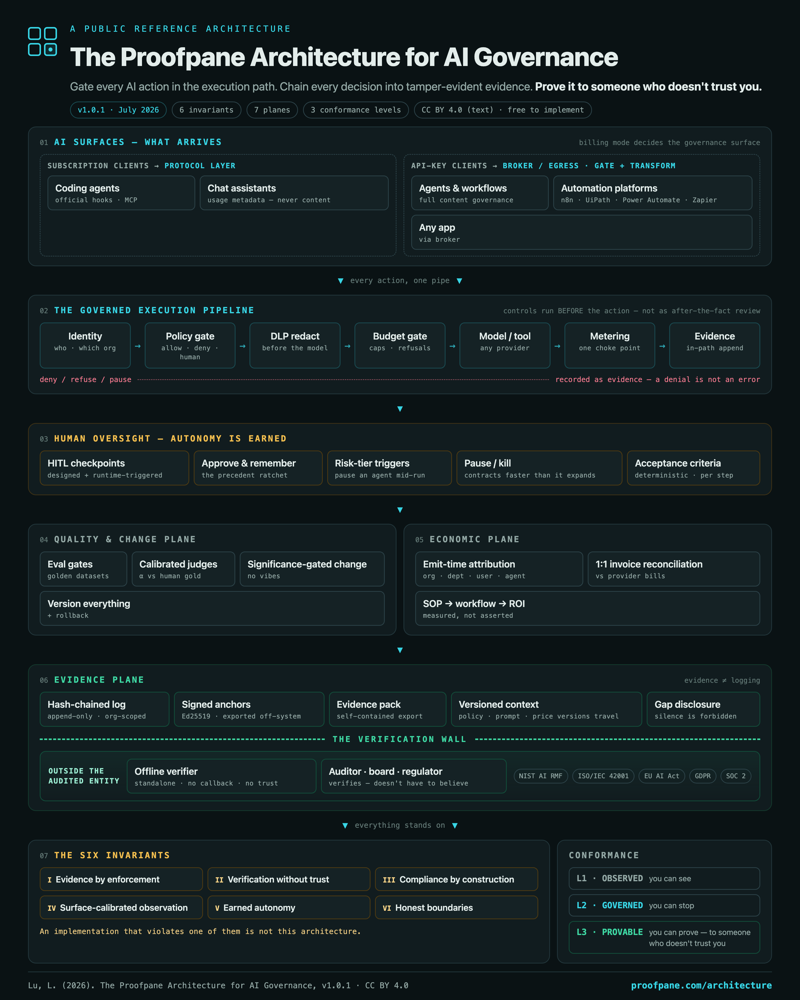

# Proofpane

**Proofpane is an AI governance platform — the evidence plane for governed AI work.**
Every AI action across coding agents (Claude Code, Cursor, Codex, Hermes, Claude
Desktop), workflow platforms (n8n, UiPath, Power Automate, Zapier, Make) and direct
LLM API calls is policy-gated **in the execution path** (allow / deny / redact /
pause for a human), cost-metered, and recorded in a SHA-256 hash-chained,
tamper-evident audit log that exports as an **Ed25519-signed Evidence Pack** an
auditor verifies **offline** — no vendor account, no trust in us required.

## The architecture



The architecture is a **public, versioned reference** — not a private rubric:

- **Read it:** [proofpane.com/architecture](https://proofpane.com/architecture/) — interactive map + full Markdown spec
- **Cite it:** DOI [10.5281/zenodo.21402331](https://doi.org/10.5281/zenodo.21402331) (CC BY 4.0 — anyone may implement it)
- **Core claim:** evidence must be checkable by parties who trust *neither the operator nor the vendor* — and so must the rubric it is graded against. A standard that can quietly move is not a standard.

The MCP server below is one enforcement point of this architecture: the
on-machine gate for MCP-speaking AI clients.

## This repo

This repo hosts download artefacts for [proofpane.com](https://proofpane.com)
and is the public home of the **Proofpane MCP server** (the `airgov_daemon`).
The main Proofpane codebase is private; this public mirror gives browsers
(Chrome Safe Browsing, Edge SmartScreen) a high-reputation host so downloads
aren't flagged as "unverified".

## Proofpane MCP server

`airgov_daemon mcp` is a stdio [Model Context Protocol](https://modelcontextprotocol.io)
server — a governance layer that runs on the user's machine and exposes local
tools to MCP clients (Claude Desktop, Cursor, Codex, …) under policy control.
Every call is policy-gated, DLP-redacted before a model sees a secret, and
recorded on a hash-chained, offline-verifiable audit trail.

**Tools advertised** (`tools/list`, no pairing needed): `bash`, `read`, `write`,
`edit`, `glob`, `grep`, `listdir`, `search_compliance_docs`, `ingest_to_rag`,
`session_search`, `skills_list`, `skill_view`, `skill_manage`.

### Run it

```bash
airgov_daemon mcp     # stdio MCP server (from a downloaded binary)
```

### Container / directory checks (e.g. Glama)

A [`Dockerfile`](./Dockerfile) is included that pulls the public prebuilt Linux
binary and runs the server in `mcp` mode, so an automated directory can start it
and introspect (`initialize` + `tools/list`) **without the private source**:

```bash
docker build -t proofpane-mcp .
docker run --rm -i proofpane-mcp     # speaks stdio MCP
```

## Get the daemon

See [proofpane.com/install](https://proofpane.com/install) for the
guided install. Direct download links live on the
[Releases](https://github.com/proofpane/releases/releases) page.

## SHA-256 verification

Every binary ships with a `.sha256` sibling:

```bash
shasum -a 256 -c ProofpaneDaemon-macos-x86_64.zip.sha256
```

## Reporting issues

For daemon issues, email Louie.Lu@proofpane.com.

## License

This mirror repo's scaffolding (this README, the `Dockerfile`, `glama.json`) is
released under the [MIT License](./LICENSE). **The Proofpane daemon it
distributes is proprietary software** — see [proofpane.com](https://proofpane.com).
The architecture reference is CC BY 4.0 via its [DOI](https://doi.org/10.5281/zenodo.21402331).
